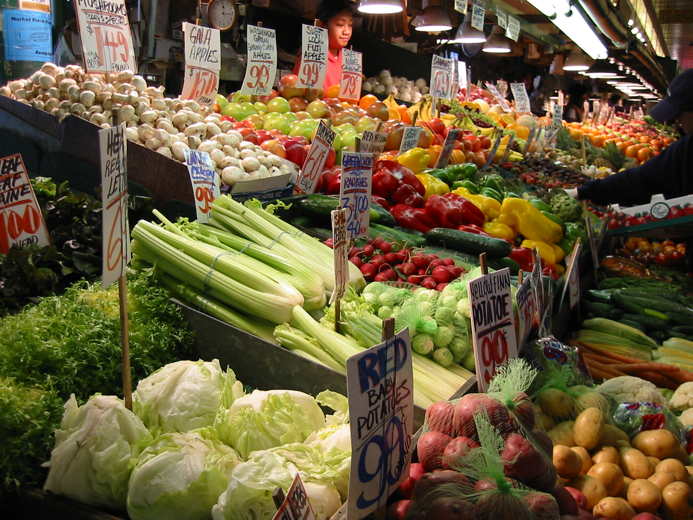

Grocery-List-Maker
==================

Grocery-List-Maker for Use by Anyone who Purchases Groceries in Stores

Why?
-----------
Having recently become a vegetarian, I want to use some new recipes.  The frustrating thing is that when I want to make something from a recipe, I am inevitably missing some random ingredient like condensed milk.  This program allows you to choose a few recipes to use in the coming week and then shop for the ingredients you will need to purchase.

Where is it?
------
Click here to try the application: (GroceryListMaker)[https://rawgit.com/peoplespete/GroceryListMaker/master/index.html]

How To Use
-----------
This web app is designed for anyone who shops for food.

1. Type in the name of a food you would like to cook.
2. Hit enter or click `search`
3. Choose one of search results by clicking on it.  (If your search didn't produce any foods you were interested in, jump back to step 2.)
4. Repeat steps 2 and 3 until you have all the recipes you'd like.
5. Now look through the Grocery List and click the `x` on any items that you already have in your pantry.
6. Shop at your favorite store with the grocery list.
7. Click on the `Open Recipe Links` button to see all your recipe instructions.  (If you would only like to see one set of recipe instructions at a time, simply click on the recipe in the Your Recipes section.)

Additional Resources
--------------------
This app was built using HTML, CSS, JavaScript, JQuery, and a recipe API called [Yummly](https://developer.yummly.com/).
